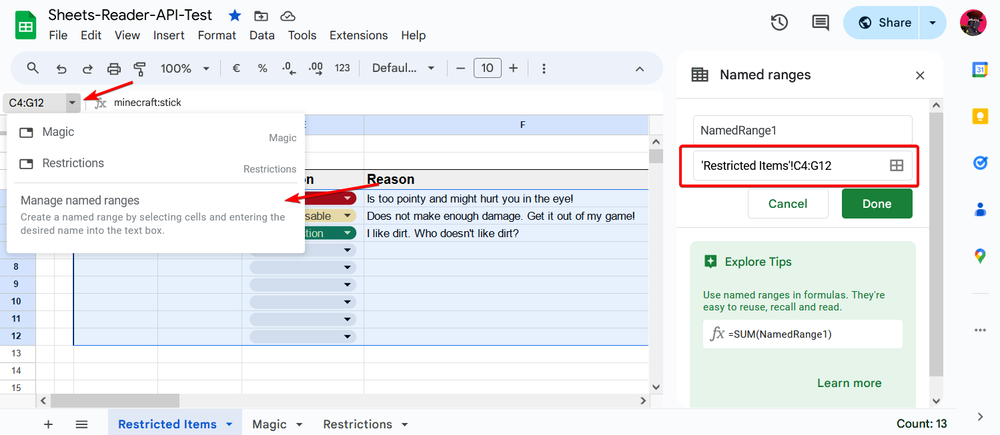
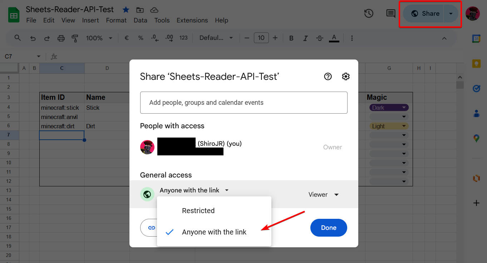

# Google Sheets Reader for Fabric

A library mod for Fabric Minecraft which retrieves Google Sheets data.
By itself this library mod does not change gameplay behavior but provides data at run-time
which can be used by other mods.

This library is only needed on the logical server side. Users only need to install it, if they want to use
it in a single player environment. For anything specific, check out the mods which make use of this library and
follow their instructions.

## Installation & Dependencies

For installation simply add the library like any other mod to your minecraft instance.

If you want to add this library as a dependency to your mod, add the following code to your `build.gradle` file.

```
repositories {
    // ...

    // Google Sheets Reader API
    maven { url = "https://repo.repsy.io/mvn/fabricated-atelier/fabric-sheets-reader/" }
}
```

```
dependencies {
    // ...
    
    // google-sheets-reader-api
    implementation "net.shirojr:sheetsreader:${project.google_sheets_reader_version}"
}
```

Then in your `gradle.properties` file add the version number using the `google_sheets_reader_version` variable.
You can find available versions at our 
[Maven repository](https://repo.repsy.io/mvn/fabricated-atelier/fabric-sheets-reader/) or in the 
[Releases](https://github.com/JR1811/google-sheets-reader/releases).

Also don't forget to add the `sheetsreader` modid to the `depends` section in your `fabric.mod.json` file.

## How to use

To access the Google Sheets API, credentials are needed to verify the usage.
For the credentials of this Google Sheets Reader Library, you need three values:

- API key
- Sheet ID
- Range

First set up a project, if you don't have one already, in the [Google Console](https://console.cloud.google.com/apis/). 
Enable the Google Sheets API and get a new API key from there. Take a closer look at the settings since there are many
options to handle the API key in a safer way.

After that you can retrieve the Sheet ID from your spreadsheet's URL:

ht<span>tps://docs.google.com/spreadsheets/d/**SpreadSheetID**/edit#gid=0

To get the range use the standard range notation of Google Sheets. You can also access the range of your current
selection.



Also prepare the sheet so that it is publicly viewable.



Check out the [API README](src/main/java/net/shirojr/sheetsreader/api/README.md) file to see where and how the
credentials need to be stored.

### Safety and Liability

This library provides no custom networking (S2C or C2S) and doesn't share any credentials over the network.

The data from the sheets is accessed on the logical server side, so if you need access to them on the client side,
simply implement the S2C networking by yourself. 

**Just keep in mind to NOT share the credentials**, be it the credentials retrieved from the config or the datapacks.
Just evaluate the credentials on the logical server side first and then send the retrieved sheets data over the network.

Specifically the API key should not be shared by any means or be uploaded to e.g. GitHub repositories. Depending on the
setup it can give full access to read and write operations on your sheets and allow for quota abuse.
In case of accidentally shared keys, make sure to delete and generate a new API key.

Also make sure to download this library and its mods, which depend on it, only from official sources.

This mod, and the involved mod developers, are not responsible for any shared data and other damages on your end!


